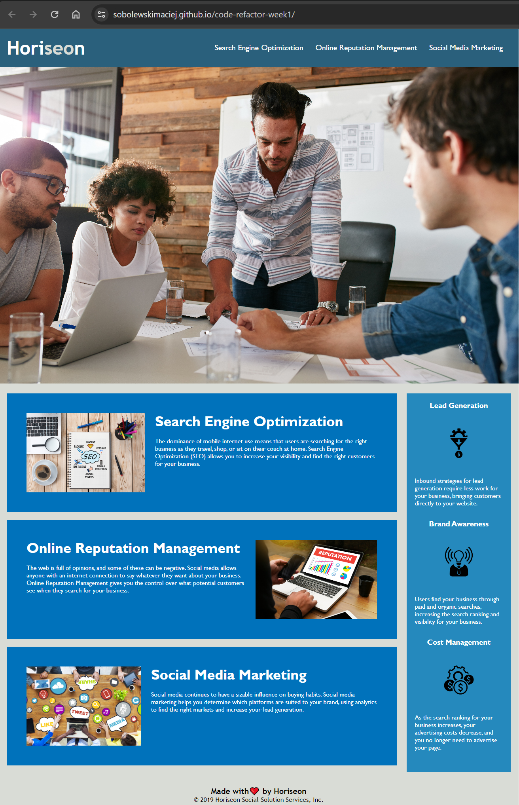

# code-refactor-week1

## Description

This chalenge was based on user story provided by EdX Front end development bootcamp.

### User Story

```
AS A marketing agency
I WANT a codebase that follows accessibility standards
SO THAT our own site is optimized for search engines
```

### Acceptance criteria

* Semantic HTML elements can be found throughout the source code
* HTML elements follow a logical structure independent of styling and positioning
* Image and icon elements contain accessible `alt` attributes
* Heading attributes fall in sequential order
* Title elements contain a concise, descriptive title


### Link to deployed page

[Horiseon](https://sobolewskimaciej.github.io/code-refactor-week1/ "Horiseon website")


### Screenshot



### License

Please refer to the LICENSE in the repo.

